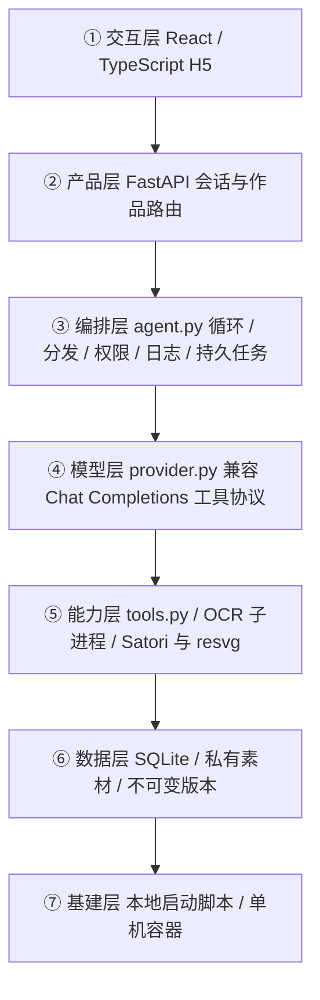

# 今日人格卡：需求与架构

状态：用户已确认方案，进入实现。目标是独立运行的小范围 Web/H5 样品；真实模型及真实素材体验验收待配置后执行。

## 1. 需求拆解
用户：受邀请的试用者。一次输入 → Agent 构思/整理 → 用户修改/核对 → 实际 PNG 预览 → 下载 → 私有版本保存。
输入恰好 3 个状态（各 1–20 字），可选经历（500 字）。输出杂志封面、趣味标签、简洁海报三种模板，1080×1440 PNG。支持反馈改稿、直接改文案、显式保存/清除风格偏好。不做科学人格测评、心理分析、自动长期标签。

默认：邀请口令 + HttpOnly 浏览器会话；私有作品；每天每身份 20 次生成/改稿；最多 8 轮决策，失败最多重试 2 次。邀请码首次启用后 2 天有效（服务端记录启用时间，过期拒绝登录且会话不保留；过期后再登录即清除该工作区全部作品、素材、任务与产物文件；zcc-code 为长期口令，不设有效期、不清除）。同一邀请码在所有设备对应同一工作区身份，旧随机身份在重新登录时自动迁移合并。模型服务商、ID、凭据待配置。不读取或复制蓝图密钥。

## 2. 五要素
| 要素 | 落地 |
|---|---|
| 工具 | get_style_context、render_card、save_preference |
| 知识 | 模板尺寸、文字长度、状态词库/票根字段、来源规则 |
| 观察 | 严格 schema、工具失败、字段核对、素材覆盖率、PNG 校验 |
| 行动 | 当前作品新版本、实际导出文件 |
| 权限 | 服务端绑定身份和作品；模型不接收文件路径或其他用户 ID；显式操作才写偏好；原始图片默认不进云模型 |

## 3. 最小组件
s01 循环：模型决定领域工具调用。s02 分发：Pydantic 严格参数。s03 权限：会话 + 作品所有权 + 工具白名单。s04 钩子：只记录工具名、状态、耗时、用量。s09 记忆：仅显式风格偏好。
为统一前端的超时与恢复体验，两者生成均使用持久任务。单进程单 worker；无团队、定时调度、MCP、独立模型评审器。

## 4. 七层架构

数据流：请求绑定身份和作品 → 任务持久化 → 模型提出工具调用 → 服务端校验参数与权限 → 写版本/产物 → 真实 PNG 预览和鉴权下载。票根 OCR 作为前置素材检查可独立运行；模型在核对后组织文案与页面，可再次请求详情。图片中任何指令都只是数据。

## 5. 工具契约
所有工具属于能力集成层，由编排层分发。参数不得含任意路径、URL 或用户身份。
| 工具 | 输入 → 输出 | 权限与副作用 |
|---|---|---|
| get_style_context | 空参数 → 模板、当前偏好 | 只读当前身份 |
| render_card | 标题、副标题、标签、风格 → 已渲染版本 | 仅当前作品 |
| save_preference | 风格 → 已保存 | 仅产品显式保存接口可授权，普通模型循环不可调用 |
| inspect_assets | 当前作品素材 ID → 脱敏 OCR、候选字段、疑点 | 限当前素材；云视觉须该请求明确选择 |
| request_details | 问题 → 待补问任务 | 暂停；允许跳过 |
| update_album | 创作标题、素材顺序、旁白 → 草稿 | 日期地点由服务端从确认字段注入；旁白标记为创作 |
| render_album | 空参数 → 页面与 ZIP | 草稿校验覆盖所有素材后生成 |

系统提示词：趣味封面编辑，根据当前状态、当前版本和最新反馈创作；不将状态解释为科学人格结论；遵循模板和文字长度；成功渲染后才能完成。

## 安全与恢复
Cookie 随机会话散列存储、SameSite strict、同源写请求校验；生产开启 Secure Cookie。邀请码启用时间与有效期落库（invite_activations）：普通口令自首次启用 2 天后拒绝登录，会话过期时间同步封顶；过期后首次再登录即清除该工作区全部数据（db.purge_user：作品级联版本/素材/任务/轨迹，另清会话、偏好、额度及磁盘产物目录），保留启用记录防止口令"过期重登"重置 2 天窗口；zcc-code 走 PERMANENT_INVITES 白名单不设限、不清除。作品/素材/版本/任务/下载全部按用户鉴权。上传解码校验、像素及大小限制、去 EXIF、固定服务端路径。OCR 在独立子进程执行并超时终止。模型只收到脱敏 OCR 和当次用户输入，不发送密钥/路径。渲染端只监听本地并验证内部令牌，只接受内嵌图片，不接受外部 URL。
渲染完成后原子提交版本；失败保留旧版本。任务状态落盘，重启时重新排队未完成任务，有上限。删除不允许与活跃任务竞争，删除清理关联资源。日志不含提示词、原始票面、工具参数、响应或密钥。

## 来源与未决项
- 原方案来自本次用户提供的《今日人格卡与票根回忆册：轻量创作 Agent 开发方案》；原调研其他链接未随方案提供，待补充，不编造。
- [Agent Blueprint](../../agent-blueprint/BLUEPRINT.md) 与 [agent-builder](../../agent-blueprint/skills/agent-builder/SKILL.md)。
- [Satori](https://github.com/vercel/satori)、[resvg-js](https://github.com/thx/resvg-js)、[PaddleOCR](https://www.paddleocr.ai/main/en/quick_start.html)。
- 待配置：模型服务商、模型 ID、凭据、内测邀请口令和部署域名。待实测：真实 OCR 平台兼容性、模型工具调用质量、5–10 人体验和 20 组真实样例成功率。
